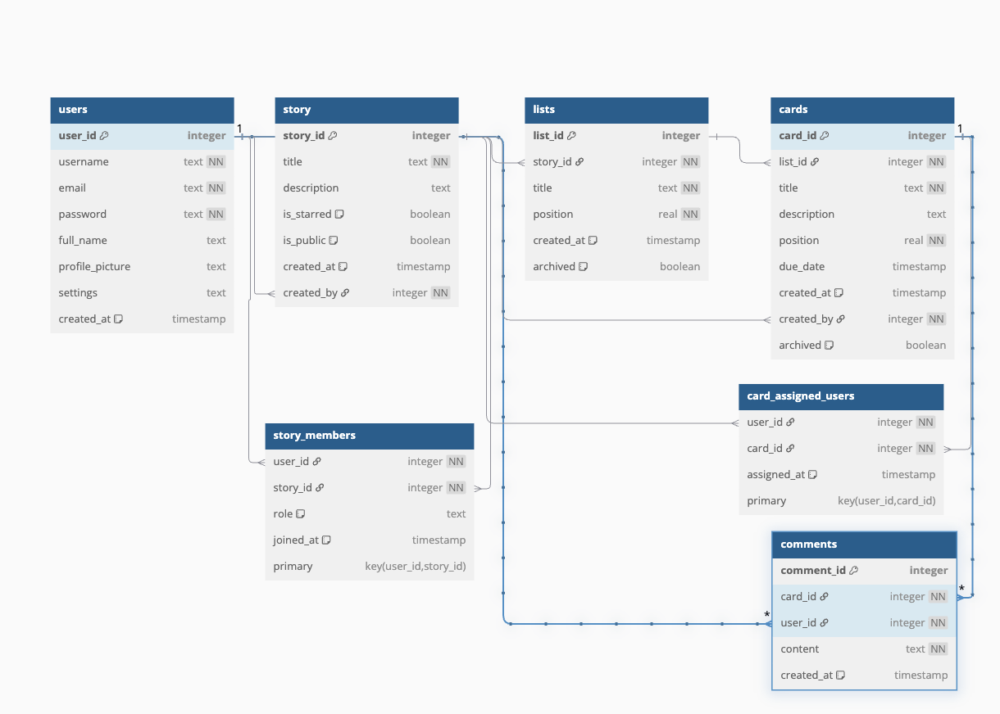

# Moonwind 🌙


## ✨ Características Principales

*   Gestión de usuarios.
*   Creación y organización de "historias" (proyectos o tableros).
*   Listas y tarjetas para desglosar tareas o ideas.
*   Comentarios en tarjetas para colaboración.
*   Asignación de usuarios a tarjetas.

## 📋 Requisitos Previos

## Queries

## Opción 1
Entrar el google collab donde puedes hacer consultas, y correr las queries requeridas por el equipo de código facilito
la opción recomendada para no tener que instalar nada en el proyecto
[Google colab moonwind](https://colab.research.google.com/drive/1-fjCWC0Gids663u0YaCEqRtL8UiByXNs?usp=sharing)

## Opción 2
En la carpeta `queries/codigo_facilito_queries.py` se encuentran las consultas SQL solicitadas para Código Facilito.
Estas queries permiten extraer información específica de la base de datos según los requerimientos del curso o proyecto
para correr estas queries hay que irnos a la parte de abajo donde tenemos `if __name__ == '__main__':`
y para probar cada querie hay que quitar el comentario dependiendo la que queremos probar y en la terminal corremos el comando:

    ```bash
    python3 src/database_setup.py
    python3 src/seed_data.py
    ```


Antes de empezar, asegúrate de tener instalado:

*   Python (se recomienda versión 3.8 o superior)
*   `pip` (el gestor de paquetes de Python)
*   `venv` (módulo para crear entornos virtuales, usualmente incluido con Python)
*   Git (para clonar el repositorio)

## 🚀 Puesta en Marcha (Getting Started)

Sigue estos pasos para configurar y ejecutar el proyecto en tu máquina local:

1.  **Clona el Repositorio:**
    ```bash
    git clone https://github.com/HectorAlrz/moonwind.git
    cd moonwind
    ```

2.  **Crea y Activa un Entorno Virtual:**
    Es altamente recomendable trabajar dentro de un entorno virtual.
    ```bash
    python3 -m venv venv
    ```
    Actívalo:
    *   En macOS y Linux:
        ```bash
        source venv/bin/activate
        ```
    *   En Windows (Git Bash o CMD/PowerShell):
        ```bash
        .\venv\Scripts\activate
        ```
    Verás `(venv)` al inicio de la línea de tu terminal si se activó correctamente.

3.  **Instala las Dependencias:**
    Si tienes un archivo `requirements.txt`, ejecuta:
    ```bash
    pip install -r requirements.txt
    ```

4.  **Configura la Base de Datos:**
    Los siguientes scripts crearán la estructura de la base de datos (`moonwind.db` dentro de la carpeta `data/`) y la poblarán con datos iniciales. Ejecútalos desde la raíz del proyecto (`moonwind/`):
    ```bash
    python3 src/database_setup.py
    python3 src/seed_data.py
    ```
    Después de ejecutar estos comandos, deberías tener un archivo `data/moonwind.db` con las tablas y los datos.
```bash


📁 Estructura del Proyecto
moonwind/
├── data/                     # Almacena el archivo de base de datos
│   └── moonwind.db
├── src/                      # Código fuente principal de la aplicación
│   ├── __init__.py
│   ├── database_setup.py     # Script para crear el esquema de la BD
│   ├── seed_data.py          # Script para poblar la BD con datos iniciales
│   ├── utils/                # Módulos de utilidad (ej: db.py para conexión)
│   │   ├── __init__.py
│   │   └── db.py
│   ├── queries/              # Módulos con funciones de consulta SQL
│   │   └── user_queries.py
│   │   └── codigo_facilito_queries.py
├── venv/                     # Entorno virtual de Python (ignorado por Git)
├── .gitignore                # Archivos y carpetas ignorados por Git
├── requirements.txt          # Dependencias del proyecto (generar con `pip freeze > requirements.txt`)
└── README.md                 # Este archivo

# Esquema de la base de datos

🏗️ Esquema de la Base de Datos

📄 Tabla users
Contiene la información de los usuarios registrados.

| Columna           | Tipo      | Descripción                  |
| ----------------- | --------- | ---------------------------- |
| `user_id`         | INTEGER   | Primary Key, autoincremental |
| `username`        | TEXT      | Nombre de usuario único      |
| `email`           | TEXT      | Correo electrónico único     |
| `password`        | TEXT      | Contraseña encriptada        |
| `full_name`       | TEXT      | Nombre completo del usuario  |
| `profile_picture` | TEXT      | URL o ruta del avatar        |
| `settings`        | TEXT/JSON | Configuración personalizada  |

📄 Tabla story
Representa una historia principal que agrupa listas y tarjetas (como en Trello o Notion).

| Columna      | Tipo     | Descripción                           |
| ------------ | -------- | ------------------------------------- |
| `story_id`   | INTEGER  | Primary Key                           |
| `title`      | TEXT     | Título de la historia                 |
| `created_by` | INTEGER  | Foreign Key → `users.user_id`         |
| `created_at` | DATETIME | Fecha de creación                     |
| `is_starred` | INTEGER  | 0 o 1 (booleano) para marcar favorita |


📄 Tabla story_members
Lista de miembros que tienen acceso a una historia.

| Columna     | Tipo     | Descripción                    |
| ----------- | -------- | ------------------------------ |
| `user_id`   | INTEGER  | Foreign Key → `users.user_id`  |
| `story_id`  | INTEGER  | Foreign Key → `story.story_id` |
| `role`      | TEXT     | `'admin'` o `'member'`         |
| `joined_at` | DATETIME | Fecha de unión                 |


🔐 Clave primaria compuesta: (user_id, story_id)

📄 Tabla lists
Agrupa tarjetas dentro de una historia.

| Columna    | Tipo    | Descripción                    |
| ---------- | ------- | ------------------------------ |
| `list_id`  | INTEGER | Primary Key                    |
| `title`    | TEXT    | Título de la lista             |
| `story_id` | INTEGER | Foreign Key → `story.story_id` |
| `position` | INTEGER | Orden relativo en la historia  |


📄 Tabla cards
Tarjetas dentro de una lista (tareas o ideas).

| Columna       | Tipo     | Descripción                   |
| ------------- | -------- | ----------------------------- |
| `card_id`     | INTEGER  | Primary Key                   |
| `title`       | TEXT     | Título de la tarjeta          |
| `description` | TEXT     | Descripción larga             |
| `list_id`     | INTEGER  | Foreign Key → `lists.list_id` |
| `position`    | INTEGER  | Posición en la lista          |
| `due_date`    | DATETIME | Fecha límite                  |


📄 Tabla comments
Comentarios que los usuarios hacen en una tarjeta.

| Columna      | Tipo     | Descripción                   |
| ------------ | -------- | ----------------------------- |
| `comment_id` | INTEGER  | Primary Key                   |
| `card_id`    | INTEGER  | Foreign Key → `cards.card_id` |
| `user_id`    | INTEGER  | Foreign Key → `users.user_id` |
| `content`    | TEXT     | Texto del comentario          |
| `created_at` | DATETIME | Fecha y hora del comentario   |


📄 Tabla card_assigned_users
Relaciona usuarios con tarjetas asignadas (muchos a muchos).

| Columna   | Tipo    | Descripción                   |
| --------- | ------- | ----------------------------- |
| `card_id` | INTEGER | Foreign Key → `cards.card_id` |
| `user_id` | INTEGER | Foreign Key → `users.user_id` |

🔐 Clave primaria compuesta: (card_id, user_id)

```
# Esquema de la base de datos


📘 Notas Técnicas
Todas las claves foráneas respetan PRAGMA foreign_keys = ON en SQLite.

is_starred actúa como un booleano: 0 (no destacada), 1 (destacada).

Las tablas story_members y card_assigned_users usan claves primarias compuestas para evitar duplicados.
